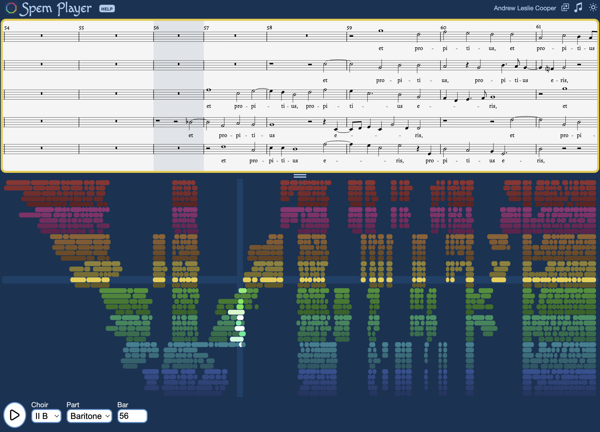

# Spem Player

Are you about to perform Thomas Tallis's 40-part motet, _Spem in alium_? Worried about your entry on the "staircase of doom"? This player helps singers practice their parts with accentuated recordings of each of the 40 voices.

**Live site:** [www.spemplayer.net](https://www.spemplayer.net)

## Recordings

Two accentuated recordings are available:

- **Andrew Leslie Cooper** — solo vocal synthesis of all 40 parts
- **Choir of the Earth** — sung by a global virtual choir ([choirofthearth.com](https://www.choirofthearth.com))

Toggle between recordings using the button in the top-right corner.

## Features

### Score View

- Displays SVG sheet music generated from LilyPond sources
- Auto-scrolls during playback
- Highlights the current bar
- Switch between **modern** and **early** notation clefs

### Canvas Overview

- Visual map of all 8 choirs by 5 parts across all 140 bars
- Colour-coded by choir (HSL palette)
- Pulse animation shows active notes during playback
- Click or tap any bar to jump directly to that position

### Audio Controls

- Play / pause with progress tracking
- Select any choir (I–VIII) and part (Soprano, Alto, Tenor, Baritone, Bass)
- Jump to any bar (0–139)
- Bar 0 is an intro bar with a shortened beat count

### Keyboard Shortcuts

- `1`–`8`: select choir
- `S`: soprano
- `A`: alto
- `T`: tenor
- `R`: baritone
- `B`: bass
- `X`: all voice parts
- `←` / `→`: select bar
- `V`: toggle between recordings
- `M`: toggle modern / early notation
- `D`: toggle dark / light mode
- `Enter` or `Space`: start or stop playback
- `?`: show help panel

Shortcuts are ignored when focus is on an input field or `<select>` element.

### Display

- **Dark / light mode** toggle (top-right moon / sun icon)
- Responsive layout for desktop and mobile
- Splitter between score and canvas allows resizing

## Source Layout

- `index.html` / `index.ts` — single-page markup and application bootstrap
- `src/ts/` — TypeScript source: custom elements, shared types, config, LilyPond parser
- `src/scss/` — SCSS styles with dark/light theme variables
- `src/ohmjs/` — Ohm.js grammar for LilyPond parsing
- `src/lilypond/` — LilyPond source files (two editions: Hugh Keyte and OUP)
- `src/scores/` — SVG scores generated from LilyPond
- `src/test/` — unit and integration tests (Vitest)
- `public/audio/` — MP3 recordings (ALC and CotE per-part tracks)
- `public/spem.json` — runtime configuration (choir count, parts, tempo)
- `build/` — build scripts (LilyPond invocation, SVG post-processing)
- `doc/` — developer documentation

## For Developers

- `doc/BUILD.md` — development setup, build commands, and deployment
- `doc/TESTING.md` — running and writing tests
- `doc/CONTRIBUTING.md` — architecture overview, conventions, and contribution process

## Licence

The software source code in this repository (TypeScript, HTML, CSS, shell scripts,
and build configuration) is licensed under the MIT Licence. See `LICENSE` for
the full text.

This licence does **not** apply to:

- **Audio recordings** in `public/audio/` — licensed separately by their
  respective copyright holders (Andrew Leslie Cooper and Choir of the Earth).
- **Musical scores** in `src/scores/` — derived from editorial editions with
  their own copyright status.
- **Lilypond source files** in `src/lilypond/` — see individual files for
  attribution.

Score and audio licensing is tracked in ticket #217.
